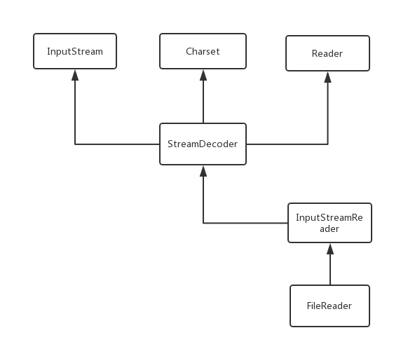
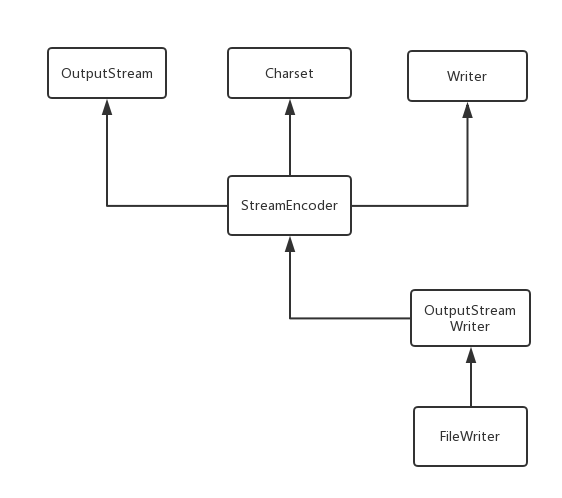

###FileReader和FileWriter介绍
- FileReader
  - “文件字符输入流”，一般用于读取文本形式的文件，也可以用来读取字节形式文件，但是会存在乱码问题。
- FileWriter
  - ”文件字符输出流”，一般用于写出本形式的文件，也可以用来写出字节形式文件，但是乱码问题依然不能完全避免
###原理分析
- FileReader
  - 构造方法
  ```
      // 构造器1
      // 可以看出其底层传入依然是字节流，只是依赖了InputStreamReader进行编码和解码操作
      // 其余构造器作用类似
      public FileReader(String fileName) throws FileNotFoundException {
          super(new FileInputStream(fileName));
      }
      
      public FileReader(File file) throws FileNotFoundException {
           super(new FileInputStream(file));
      }
      
      public FileReader(FileDescriptor fd) {
           super(new FileInputStream(fd));
      }
      
      // 这是InputStreamReader类中的构造方法，上面三个构造器最终调的都是这个构造方法，
      // FileReader类是继承与InputStreamReader这个类
      public InputStreamReader(InputStream in) {
          super(in);
          try {
              sd = StreamDecoder.forInputStreamReader(in, this, (String)null); // ## check lock object
          } catch (UnsupportedEncodingException e) {
              // The default encoding should always be available
              throw new Error(e);
          }
      }
  ```
  - read()
  ```
      // 看似是InputStreamReader类完成的自动解码编码操作，其实InputStreamReader中调用了StreamDecoder类中方法完成的操作
      private final StreamDecoder sd;
      
      // 调用的是InputStreamReader中的read方法
      public int read(char cbuf[], int offset, int length) throws IOException {
          // 进行读取操作
          return sd.read(cbuf, offset, length);
      }
      
      // 以下两个方法其实StreamDecoder类中的，也是真正的读取操作的地方
      public int read() throws IOException {
              return this.read0();
      }
      
      private int read0() throws IOException {
          Object var1 = this.lock;
          synchronized(this.lock) {
              if (this.haveLeftoverChar) {
                  this.haveLeftoverChar = false;
                  return this.leftoverChar;
              } else {
                  // 两个字节为单位进行读取
                  char[] var2 = new char[2];
                  int var3 = this.read(var2, 0, 2);
                  switch(var3) {
                  case -1:
                      return -1;
                  case 0:
                  default:
                      assert false : var3;
  
                      return -1;
                  case 2:
                      this.leftoverChar = var2[1];
                      this.haveLeftoverChar = true;
                  case 1:
                      return var2[0];
                  }
              }
          }
      }
      
  ```
  - read(char cbuf[], int offset, int length)，此方法调用的和上面的类似，直接看源码
  ```
   // InputStreamReader的方法
   public int read(char cbuf[], int offset, int length) throws IOException {
          return sd.read(cbuf, offset, length);
   }
    
   // StreamDecoder类中的方法    
   public int read(char[] var1, int var2, int var3) throws IOException {
       int var4 = var2;
       int var5 = var3;
       Object var6 = this.lock;
       synchronized(this.lock) {
           this.ensureOpen();
           if (var4 >= 0 && var4 <= var1.length && var5 >= 0 && var4 + var5 <= var1.length && var4 + var5 >= 0) {
               if (var5 == 0) {
                   return 0;
               } else {
                   byte var7 = 0;
                   if (this.haveLeftoverChar) {
                       var1[var4] = this.leftoverChar;
                       ++var4;
                       --var5;
                       this.haveLeftoverChar = false;
                       var7 = 1;
                       if (var5 == 0 || !this.implReady()) {
                           return var7;
                       }
                   }
                   if (var5 == 1) {
                       int var8 = this.read0();
                       if (var8 == -1) {
                           return var7 == 0 ? -1 : var7;
                       } else {
                           var1[var4] = (char)var8;
                           return var7 + 1;
                       }
                   } else {
                       return var7 + this.implRead(var1, var4, var4 + var5);
                   }
               }
           } else {
               throw new IndexOutOfBoundsException();
           }
       }
   }
  ```
  - getEncoding()返回字符的编码格式
  ````
      public String getEncoding() {
          return sd.getEncoding();
      }
      
      public String getEncoding() {
          // 如果流没有处于打开状态，则返回null
          return this.isOpen() ? this.encodingName() : null;
      }
          
      String encodingName() {
          // 返回字符编码名称
          return this.cs instanceof HistoricallyNamedCharset ? ((HistoricallyNamedCharset)this.cs).historicalName() : this.cs.name();
      }
  ````
- FileWriter
  - 构造方法
  ```
  public FileWriter(String fileName) throws IOException {
          super(new FileOutputStream(fileName));
  }
  
  public FileWriter(String fileName, boolean append) throws IOException {
      super(new FileOutputStream(fileName, append));
  }
  
  public FileWriter(File file) throws IOException {
      super(new FileOutputStream(file));
  }
  
  public FileWriter(File file, boolean append) throws IOException {
       super(new FileOutputStream(file, append));
  }
  
  public FileWriter(FileDescriptor fd) {
      super(new FileOutputStream(fd));
  }
  
  // 其实调用的是此构造器进行初始化操作
  public OutputStreamWriter(OutputStream out) {
      super(out);
      try {
          se = StreamEncoder.forOutputStreamWriter(out, this, (String)null);
      } catch (UnsupportedEncodingException e) {
          throw new Error(e);
      }
  }
  ```
  - write(char cbuf[], int off, int len)
  ```
      public void write(char cbuf[], int off, int len) throws IOException {
          // 执行写入操作
          se.write(cbuf, off, len);
      }
      
      public void write(char[] var1, int var2, int var3) throws IOException {
          Object var4 = this.lock;
          synchronized(this.lock) {
              this.ensureOpen();
              // 写写入的数据进行校验，尤其是char[] 数组的一些校验，规避一些基本错误
              if (var2 >= 0 && var2 <= var1.length && var3 >= 0 && var2 + var3 <= var1.length && var2 + var3 >= 0) {
                  if (var3 != 0) {
                      // 真正的写入操作,这其中包含编码和解码工作
                      this.implWrite(var1, var2, var3);
                  }
              } else {
                  throw new IndexOutOfBoundsException();
              }
          }
      }
      
      // 真正的写入，并且默认会按照系统的默认字符编码编码进行写出
      void implWrite(char[] var1, int var2, int var3) throws IOException {
          // 包装成CharBuffer对象
          CharBuffer var4 = CharBuffer.wrap(var1, var2, var3);
          if (this.haveLeftoverChar) {
              this.flushLeftoverChar(var4, false);
          }
  
          while(var4.hasRemaining()) {
              // 当CharBuffer对象中还有字符未写入，其中CharBuffer中也有类似于文件指针的东西来进行判断
              CoderResult var5 = this.encoder.encode(var4, this.bb, false);
              if (var5.isUnderflow()) {
                  assert var4.remaining() <= 1 : var4.remaining();
  
                  if (var4.remaining() == 1) {
                      this.haveLeftoverChar = true;
                      this.leftoverChar = var4.get();
                  }
                  break;
              }
  
              if (var5.isOverflow()) {
                  assert this.bb.position() > 0;
                  // 写入
                  this.writeBytes();
              } else {
                  var5.throwException();
              }
          }
  
      }
  ```
  - write(String str, int off, int len)
  ```
      // 入口1
      public void write(String str, int off, int len) throws IOException {
          se.write(str, off, len);
      }
      
      // 最低层的入口
      public void write(String str, int off, int len) throws IOException {
          synchronized (lock) {
              char cbuf[];
              if (len <= WRITE_BUFFER_SIZE) {
                  if (writeBuffer == null) {
                      writeBuffer = new char[WRITE_BUFFER_SIZE];
                  }
                  cbuf = writeBuffer;
              } else {    // Don't permanently allocate very large buffers.
                  cbuf = new char[len];
              }
              // 将字符串转为char[]数组
              str.getChars(off, (off + len), cbuf, 0);
              // 调上面的底层方法，不再赘述
              write(cbuf, 0, len);
          }
      }
      
      public void getChars(int srcBegin, int srcEnd, char dst[], int dstBegin) {
          if (srcBegin < 0) {
              throw new StringIndexOutOfBoundsException(srcBegin);
          }
          if (srcEnd > value.length) {
              throw new StringIndexOutOfBoundsException(srcEnd);
          }
          if (srcBegin > srcEnd) {
              throw new StringIndexOutOfBoundsException(srcEnd - srcBegin);
          }
          System.arraycopy(value, srcBegin, dst, dstBegin, srcEnd - srcBegin);
      }
  ```
  - write(String str)和上面的类似
  ```
      public void write(String str) throws IOException {
          write(str, 0, str.length());
      }
  ```
###总结
- FileReader能够完成字符的读取操作主要是依赖InputStreamReader完成的，而InputStreamReader能够完成字符的读取主要的依赖StreamDecoder完成的
- 字符读取流关系结构图  

- FileWriter能够完成字符的读取操作主要是依赖OutputStreamReader完成的，而OutputStreamReader能够完成字符的读取主要的依赖StreamEncoder完成的
- 字符写出流关系结构图   

- 建议对文件的操作尽量选择Writer和Reader,如果是二进制文件或文件复制操作，进行选择字节流，毕竟字符流的底层也是字节流
