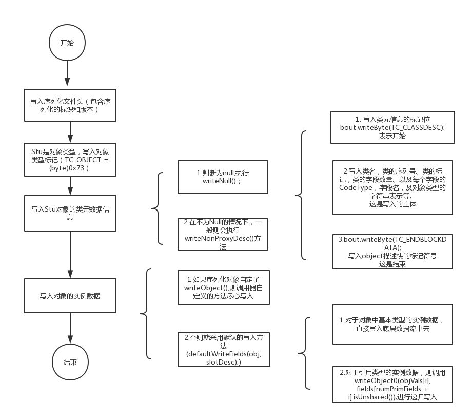

### 1.什么是序列化和反序列化
+ 序列化  
  是指将Java对象保存为二进制字节码的过程。
+ 反序列化  
  将二进制字节码重新转成Java对象的过程。
### 2.为什么序列化
+ 我们知道，一般Java对象的生命周期比Java虚拟机短，而实际的开发中，我们需要
在Jvm停止后能够继续持有对象，这个时候就需要用到序列化技术将对象持久到磁盘或数据库。
+ 在多个项目进行RPC调用的，需要在网络上传输JavaBean对象。我们知道数据只能以二进制的
形式才能在网络上进行传输。所以也需要用到序列化技术。
### 3.序列化的底层原理
1. 程序入口
```
            Student  stu1 = new Student(1001, "jack", "play");
            Student  stu2 = new Student(1002, "tom", "sleep");
            ObjectOutputStream oos = new ObjectOutputStream(new FileOutputStream("d:\\stu.dat"));
            oos.writeObject(stu1);
            oos.writeObject(stu2);
            oos.close(); 
```
2. 序列化
- 在调用writeObject()方法之前，会先调用ObjectOutputStream的构造函数，生成
一个ObjectOutputStream对象。
```
    public ObjectOutputStream(OutputStream out) throws IOException {
        verifySubclass();
        // bout是底层的数据字节容器
        bout = new BlockDataOutputStream(out);
        handles = new HandleTable(10, (float) 3.00);
        subs = new ReplaceTable(10, (float) 3.00);
        enableOverride = false;
        // 写入序列化文件头
        writeStreamHeader();
        // 设置文件缓存刷新配置
        bout.setBlockDataMode(true);
        if (extendedDebugInfo) {
            debugInfoStack = new DebugTraceInfoStack();
        } else {
            debugInfoStack = null;
        }
    }
```
writeStreamHeader的方法内容如下：
```
 protected void writeStreamHeader() throws IOException {
        bout.writeShort(STREAM_MAGIC);
        bout.writeShort(STREAM_MAGIC);
    }
```
其中STREAM_MAGIC和STREAM_MAGIC所代表的是序列化的标识和版本，其具体内容可在ObjectStreamConstants接口中找到
```
    /**
     * Magic number that is written to the stream header.
     */
    final static short STREAM_MAGIC = (short)0xaced;

    /**
     * Version number that is written to the stream header.
     */
    final static short STREAM_VERSION = 5;
```
2. 调用writeObject()方法进行具体的序列化写入
```
    public final void writeObject(Object obj) throws IOException {
        if (enableOverride) {
            writeObjectOverride(obj);
            return;
        }
        try {
            // 这个方法里面具体是调用writeObject0()方法进行具体的序列化操作
            writeObject0(obj, false);
        } catch (IOException ex) {
            if (depth == 0) {
                writeFatalException(ex);
            }
            throw ex;
        }
    }
```
- writeObject0的具体内容
```
    private void writeObject0(Object obj, boolean unshared)
        throws IOException
    {
        boolean oldMode = bout.setBlockDataMode(false);
        depth++;
        try {
            // handle previously written and non-replaceable objects
            int h;
            if ((obj = subs.lookup(obj)) == null) {
                writeNull();
                return;
            } else if (!unshared && (h = handles.lookup(obj)) != -1) {
                writeHandle(h);
                return;
            } else if (obj instanceof Class) {
                writeClass((Class) obj, unshared);
                return;
            } else if (obj instanceof ObjectStreamClass) {
                writeClassDesc((ObjectStreamClass) obj, unshared);
                return;
            }

            // check for replacement object
            Object orig = obj;
            // 需要序列的对象的Class对象
            Class<?> cl = obj.getClass();
            ObjectStreamClass desc;
            for (;;) {
                // 提示：跳过检查string和数组
                // REMIND: skip this check for strings/arrays?
                Class<?> repCl;
                // 创建描述c1的ObjectStreamClass对象
                desc = ObjectStreamClass.lookup(cl, true);
                if (!desc.hasWriteReplaceMethod() ||
                    (obj = desc.invokeWriteReplace(obj)) == null ||
                    (repCl = obj.getClass()) == cl)
                {
                    break;
                }
                cl = repCl;
            }
            if (enableReplace) {
                Object rep = replaceObject(obj);
                if (rep != obj && rep != null) {
                    cl = rep.getClass();
                    desc = ObjectStreamClass.lookup(cl, true);
                }
                obj = rep;
            }

            // if object replaced, run through original checks a second time
            if (obj != orig) {
                subs.assign(orig, obj);
                if (obj == null) {
                    writeNull();
                    return;
                } else if (!unshared && (h = handles.lookup(obj)) != -1) {
                    writeHandle(h);
                    return;
                } else if (obj instanceof Class) {
                    writeClass((Class) obj, unshared);
                    return;
                } else if (obj instanceof ObjectStreamClass) {
                    writeClassDesc((ObjectStreamClass) obj, unshared);
                    return;
                }
            }

            // remaining cases
            // 根据实际要写入的类型，进行不同的写入操作
            // 由此可以看出String、Array、Enum是直接写入操作的
            if (obj instanceof String) {
                writeString((String) obj, unshared);
            } else if (cl.isArray()) {
                writeArray(obj, desc, unshared);
            } else if (obj instanceof Enum) {
                writeEnum((Enum<?>) obj, desc, unshared);
            } else if (obj instanceof Serializable) {
                // 实现序列化接口的都会执行下面的方法
                // 从这里也可以看出Serializable是一个标记接口，其本身并没有什么意义
                writeOrdinaryObject(obj, desc, unshared);
            } else {
                if (extendedDebugInfo) {
                    throw new NotSerializableException(
                        cl.getName() + "\n" + debugInfoStack.toString());
                } else {
                    throw new NotSerializableException(cl.getName());
                }
            }
        } finally {
            depth--;
            bout.setBlockDataMode(oldMode);
        }
    }
```
 从上面可以看出主要做了两件事  
 1、创建了ObjectStreamClass对象  
 2、根据实际要写入的类型，进行不同的写入操作
 - writeOrdinaryObject()的主要内容
 ```
private void writeOrdinaryObject(Object obj,ObjectStreamClass desc, boolean unshared)throws IOException{
        if (extendedDebugInfo) {
            debugInfoStack.push(
                (depth == 1 ? "root " : "") + "object (class \"" +
                obj.getClass().getName() + "\", " + obj.toString() + ")");
        }
        try {
            desc.checkSerialize();
            
            // 写入Object的标记位符号,表示这是一个新的Object对象
            bout.writeByte(TC_OBJECT);
            // 写入类元数据
            writeClassDesc(desc, false);
            handles.assign(unshared ? null : obj);
            if (desc.isExternalizable() && !desc.isProxy()) {
                writeExternalData((Externalizable) obj);
            } else {
                // 写入序列化对象具体的实例数据
                writeSerialData(obj, desc);
            }
        } finally {
            if (extendedDebugInfo) {
                debugInfoStack.pop();
            }
        }
    }
```
```
    /**
     * new Class Descriptor.
     */
    final static byte TC_CLASSDESC =    (byte)0x72;

    /**
     * new Object.
     */
    final static byte TC_OBJECT =       (byte)0x73;

    /**
     * new String.
     */
    final static byte TC_STRING =       (byte)0x74;

    /**
     * new Array.
     */
    final static byte TC_ARRAY =        (byte)0x75;

    /**
     * Reference to Class.
     */
    final static byte TC_CLASS =        (byte)0x76;

```
- 接下来会调用writeClassDesc()方法写入被序列化对象的类的类元数据，writeClassDesc()如下：
```
/**
     * Writes representation of given class descriptor to stream.
     */
    private void writeClassDesc(ObjectStreamClass desc, boolean unshared)
        throws IOException
    {
        int handle;
        if (desc == null) {
            // 写入null
            writeNull();
        } else if (!unshared && (handle = handles.lookup(desc)) != -1) {
            writeHandle(handle);
        } else if (desc.isProxy()) {
            writeProxyDesc(desc, unshared);
        } else {
            writeNonProxyDesc(desc, unshared);
        }
    }
```
writeNull()内容分析：
```
    /**
     * Writes null code to stream.
     */
    private void writeNull() throws IOException {
        // TC_NULL
        bout.writeByte(TC_NULL);
    }
    
    /**
     * Null object reference.
     */
    final static byte TC_NULL =         (byte)0x70;

```
- 在不为Null的情况下，一般则会执行writeNonProxyDesc()方法
```
 /**
     * Writes class descriptor representing a standard (i.e., not a dynamic
     * proxy) class to stream.
     */
    private void writeNonProxyDesc(ObjectStreamClass desc, boolean unshared)
        throws IOException
    {
        // 类元信息的标记位
        // 表示接下来的数据代表新的Class描述符
        bout.writeByte(TC_CLASSDESC);
        handles.assign(unshared ? null : desc);

        if (protocol == PROTOCOL_VERSION_1) {
            // do not invoke class descriptor write hook with old protocol
            desc.writeNonProxy(this);
        } else {
            // 一般会执行此方法
            writeClassDescriptor(desc);
        }

        Class<?> cl = desc.forClass();
        bout.setBlockDataMode(true);
        if (cl != null && isCustomSubclass()) {
            ReflectUtil.checkPackageAccess(cl);
        }
        annotateClass(cl);
        bout.setBlockDataMode(false);
        // TC_ENDBLOCKDATA = (byte)0x78;
        // 表示对一个object的描述块的结束
        bout.writeByte(TC_ENDBLOCKDATA);

        writeClassDesc(desc.getSuperDesc(), false);
    }
```
调用写入类元信息的writeClassDescriptor()
```
    protected void writeClassDescriptor(ObjectStreamClass desc)
        throws IOException
    {
        desc.writeNonProxy(this);
    }
```
写入类元方法最后调用的是writeNonProxy()方法
```
 /**
     * Writes non-proxy class descriptor information to given output stream.
     */
    void writeNonProxy(ObjectOutputStream out) throws IOException {
        // 写入类名
        out.writeUTF(name);
        // 写入类的序列号
        out.writeLong(getSerialVersionUID());
        
        // 类的标记
        byte flags = 0;
        if (externalizable) {
            flags |= ObjectStreamConstants.SC_EXTERNALIZABLE;
            int protocol = out.getProtocolVersion();
            if (protocol != ObjectStreamConstants.PROTOCOL_VERSION_1) {
                flags |= ObjectStreamConstants.SC_BLOCK_DATA;
            }
        } else if (serializable) {
            // 一般会走这一步,标识序列化
            // final static byte SC_SERIALIZABLE = 0x02;
            flags |= ObjectStreamConstants.SC_SERIALIZABLE;
        }
        if (hasWriteObjectData) {
            // final static byte SC_WRITE_METHOD = 0x01;
            // 自定义writeObject方法
            flags |= ObjectStreamConstants.SC_WRITE_METHOD;
        }
        if (isEnum) {
            // 同上，这是枚举的标记
            flags |= ObjectStreamConstants.SC_ENUM;
        }
        // 写入类的标记
        out.writeByte(flags);

        // 写入对象的字段数量
        out.writeShort(fields.length);
        for (int i = 0; i < fields.length; i++) {
            ObjectStreamField f = fields[i];
            // 写入字段类型对应的Code(详细见下面)
            out.writeByte(f.getTypeCode());
            // 写入字段的名字
            out.writeUTF(f.getName());
            if (!f.isPrimitive()) {
                // 如果不是原始类型（即就是对象或Interface），则会写入表示对象的字符串
                out.writeTypeString(f.getTypeString());
            }
        }
    }
```
类型对应表
```
      B     ->       byte
      C     ->       char
      D     ->       double
      F     ->       float
      I     ->       int
      J     ->       long
      L     ->       class or interface
      S     ->       short
      Z     ->       boolean
      [     ->       array
```
1、调用writeUTF()方法写入对象所属类的名字，对于本例中name = com.beautyboss.slogen.TestObject.对于writeUTF()这个方法，
在写入实际的数据之前会先写入name的字节数。  
2、接下来会调用writeLong()方法写入类的序列号UID,UID是通过getSerialVersionUID()方法来获取。 
3、 接着会判断被序列化的对象所属类的flag，并写入底层字节容器中(占用两个字节)。类的flag分为以下几类:  
这是是0x02,即序列化接口。
```
   

    /**
     * Bit mask for ObjectStreamClass flag. Indicates class is Serializable.
     * 序列化接口的
     */
    final static byte SC_SERIALIZABLE = 0x02;

    /**
     * Bit mask for ObjectStreamClass flag. Indicates class is Externalizable.
     * 自定义序列化接口中writeObject等方法
     */
    final static byte SC_EXTERNALIZABLE = 0x04;

    /**
     * Bit mask for ObjectStreamClass flag. Indicates class is an enum type.
     * @since 1.5 
     * 枚举类型
     */
    final static byte SC_ENUM = 0x10;
```
注意：writeClassDesc()是一个递归方法，之后会传入其基类，并进行基类的类元信息数据表的写入。直到找到递归程序的出口（规律是从子类--->父类--->null）。
之后会继续上面的代码(写入序列化对象的实例数据)：
```
    /**
     * Writes representation of a "ordinary" (i.e., not a String, Class,
     * ObjectStreamClass, array, or enum constant) serializable object to the
     * stream.
     */
    private void writeOrdinaryObject(Object obj,
                                     ObjectStreamClass desc,
                                     boolean unshared)
        throws IOException
    {
        if (extendedDebugInfo) {
            debugInfoStack.push(
                (depth == 1 ? "root " : "") + "object (class \"" +
                obj.getClass().getName() + "\", " + obj.toString() + ")");
        }
        try {
            desc.checkSerialize();

            bout.writeByte(TC_OBJECT);
            writeClassDesc(desc, false);
            // =========================>
            // 会从这里继续执行，写入刚刚写入对象的实例化数据 ||||||||||
            // =========================>
            handles.assign(unshared ? null : obj);
            if (desc.isExternalizable() && !desc.isProxy()) {
                writeExternalData((Externalizable) obj);
            } else {
                // 写入序列化对象的实例化数据
                writeSerialData(obj, desc);
            }
        } finally {
            if (extendedDebugInfo) {
                debugInfoStack.pop();
            }
        }
    }
```
- 写入实例化数据，通过调用writeSerialData()方法
````
 /**
     * Writes instance data for each serializable class of given object, from
     * superclass to subclass.
     */
    private void writeSerialData(Object obj, ObjectStreamClass desc)
        throws IOException
    {
        // 获取序列化对象的数据布局ClassDataSlot，从父类那继承过来的在前面
        ObjectStreamClass.ClassDataSlot[] slots = desc.getClassDataLayout();
        for (int i = 0; i < slots.length; i++) {
            ObjectStreamClass slotDesc = slots[i].desc;
            // 如果序列化对象实现了自己的writeObject()方法，则进入if，否则进入else,执行默认的写入方法
            if (slotDesc.hasWriteObjectMethod()) {
                PutFieldImpl oldPut = curPut;
                curPut = null;
                SerialCallbackContext oldContext = curContext;

                if (extendedDebugInfo) {
                    debugInfoStack.push(
                        "custom writeObject data (class \"" +
                        slotDesc.getName() + "\")");
                }
                try {
                    curContext = new SerialCallbackContext(obj, slotDesc);
                    bout.setBlockDataMode(true);
                    slotDesc.invokeWriteObject(obj, this);
                    bout.setBlockDataMode(false);
                    bout.writeByte(TC_ENDBLOCKDATA);
                } finally {
                    curContext.setUsed();
                    curContext = oldContext;
                    if (extendedDebugInfo) {
                        debugInfoStack.pop();
                    }
                }

                curPut = oldPut;
            } else {
                // 默认的写入实例数据
                defaultWriteFields(obj, slotDesc);
            }
        }
    }
````
```
// 默认的写入实例数据
private void defaultWriteFields(Object obj, ObjectStreamClass desc)
        throws IOException
    {
        Class<?> cl = desc.forClass();
        if (cl != null && obj != null && !cl.isInstance(obj)) {
            throw new ClassCastException();
        }

        desc.checkDefaultSerialize();

        int primDataSize = desc.getPrimDataSize();
        if (primVals == null || primVals.length < primDataSize) {
            primVals = new byte[primDataSize];
        }
        
        // 获取对象中基本类型的实例数据，并将其放到primVals数组中
        desc.getPrimFieldValues(obj, primVals);
        // 将对象基本类型的实例数据，写入底层的字节缓冲流
        bout.write(primVals, 0, primDataSize, false);
        
        // 获取类对应的引用类型的字段对象
        ObjectStreamField[] fields = desc.getFields(false);
        Object[] objVals = new Object[desc.getNumObjFields()];
        int numPrimFields = fields.length - objVals.length;
        desc.getObjFieldValues(obj, objVals);
        // 将对应的对象类型字段保存到objVals数组中去
        for (int i = 0; i < objVals.length; i++) {
            if (extendedDebugInfo) {
                debugInfoStack.push(
                    "field (class \"" + desc.getName() + "\", name: \"" +
                    fields[numPrimFields + i].getName() + "\", type: \"" +
                    fields[numPrimFields + i].getType() + "\")");
            }
            try {
                // 此时的值是：["paly", 1001,"tom"]
                // 对序列化对象中引用类型的字段，递归调用writeObject0()写入对应的数据
                writeObject0(objVals[i],
                             fields[numPrimFields + i].isUnshared());
            } finally {
                if (extendedDebugInfo) {
                    debugInfoStack.pop();
                }
            }
        }
    }
```
这个方法中做了：  
1、获取序列化类对象的基本类型的实例数据，并写入到底层的字节数据容器中去；  
2、获取对应类的引用类型(非基本类型)的字段成员，递归调用writeObject0()方法写入实例数据。
从上得知，写入数据是从父类到子类的顺序来写的。
- 思路图

### 4.序列化和单例模式
- 所谓单例：就是单例模式就是在整个全局中（无论是单线程还是多线程），该对象只存在一个实例，而且只应该存在一个实例，没有副本。
- 序列化对单例有破坏  
1、通过对某个对象的序列化与反序列化得到的对象是一个新的对象，这就破坏了单例模式的单例性。  
2、我们知道readObject()的时候，底层运用了反射的技术，
序列化会通过反射调用无参数的构造方法创建一个新的对象。
这破坏了对象的单例性。  
3、解决方案：  
在需要的单例的对象类中添加
```
    private Object readResolve() {
        return singleton;
    }

}
```
hasReadResolveMethod:如果实现了serializable 或者 externalizable接口的类中包含readResolve则返回true
invokeReadResolve:通过反射的方式调用要被反序列化的类的readResolve方法。
### 5.为什么说序列化并不安全
- 因为序列化的对象数据转换为二进制，并且完全可逆。但是在RMI调用时
所有private字段的数据都以明文二进制的形式出现在网络的套接字上，这显然是不安全的
- 解决方案  
1、 序列化Hook化（移位和复位）
2、 序列数据加密和签名
3、 利用transient的特性解决
4、 打包和解包代理
### 6.补充
 - static和transient字段不能被序列化（感兴趣的同学可以深入研究下）