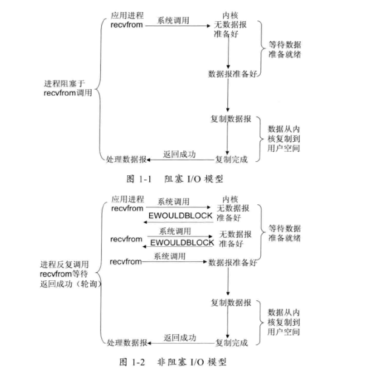

###Netty之I/O模型研究
####阻塞I/O模型
>我们知道Java中IO流中的模型都是阻塞型的，要想理解阻塞IO就必须清楚地理解什么是阻塞。网上关于介绍阻塞的很多，我 
来说一下我自己的理解。
```
    public static void test01() {
        try {
            File file = new File("D:\\1.txt");
            InputStream in = new FileInputStream(file);
            int len;
            while ((len = in.read()) != -1) {
                System.out.print((char)len);
            }
        } catch (FileNotFoundException e) {
            e.printStackTrace();
        } catch (IOException e) {
            e.printStackTrace();
        }
    }
```
>上面是一个典型的阻塞型IO例子，所谓阻塞就是当InputStream读不到数据时，会一直在read方法等待，知道读到 数据 
或者发生错误才会返回，否则会一直在那里等待，这也就是我们所谓的阻塞。
***
>Java中IO包中的流都是阻塞型的
####非阻塞I/O模型
>而非阻塞型IO则恰恰和阻塞IO相反，换上面的例子来说，就是当read方法读不到数据时，也不会在那里一直等待，而是直接返回一个未读取到数据的标识，
此后会通过轮循的方式不断调用read方法，直到读取数据，并成功完成才会停止。
***
>可以看出，非阻塞型IO,无论读取到数据不都会返回，通过返回的信息，来给应用程序
反馈信息。
***

####I/O复用模型
- 概念  
Linux提供了select/poll,进程通过将一个或多个fd传递给select或poll系统调用。操作将阻塞在
select处，这样select选择器就可以帮我们侦测多个fd是否处理就绪状态，如果有就绪的fd,将立刻
回调callback函数。
- 理解
  - 引入了一个select选择器，来检测fd状态，实现多路复用
- 存在的问题
  - select/poll的操作系统底层调用是顺序扫描fd,并且支持的fd数量有限。
- 解决
  - Linux系统了提供epoll系统调用接口，这种方式使用了基于事件驱动的方式代替了
  传统的顺序扫描，大大提高了性能。
- 模型图
  
####信号驱动I/O模型
- 概念
  - 前提是需要开启套接字信号驱动io功能，并通过系统调用sigaction执行一个信号处理函数，
  （此是系统调用立即返回，进程继续工作，它是非阻塞的。）当数据准备就绪时，就为
  该进程生成一个signo信号，通过信号回调来通知应用程序来调用recvfrom来读取数据，并通知主循环函数
  来处理数据。
- 理解
  - 引入信号驱动，通过信号处理函数来检测数据是否准备就绪，当准备就绪时就会返回一signo信号。
- 模型图
  
####异步I/O
- 概念
  - 告知内核启动某个操作，并让内核在操作完成后通知我们。（将数据从内核复制到应用程序缓存区）
- 和信号驱动的区别
  - 异步io的信号是告知我们何时完成了数据复制，而信号驱动则是告知我们何时可以开始复制数据。
- 模型图
  
####Java中的IO演变
- Java NIO的核心类库的Selector选择器就是基于epoll的多路复用技术实现的。
- Java 1.4之前都是阻塞IO
- Java 1.4之后增加NIO
- Java 1.7完善了NIO，并且增加了AIO,支持文件异步io和网络套接字io